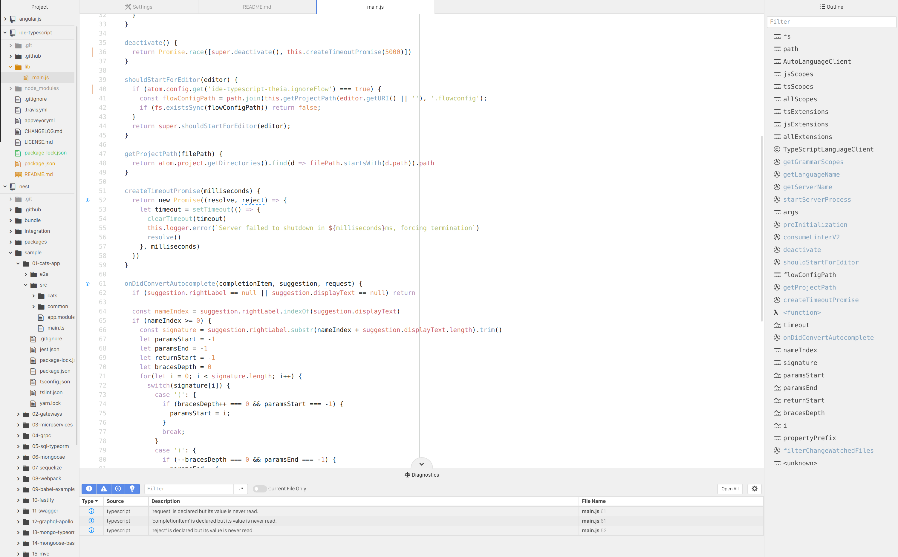

# IDE-TypeScript-Theia package

TypeScript and JavaScript language support for Atom-IDE, powered by the [Theia TypeScript Language Server](https://github.com/theia-ide/typescript-language-server)

### **If outline shows spinner forever you need to specify *Path to Node.js Executable* in Settings**

## Package Status

This package is a fork of [IDE-TypeScript](https://github.com/atom/ide-typescript) which has been modified to use a different Language Server. Since Microsoft's [LSP](https://github.com/Microsoft/language-server-protocol) allows for essentially drop in replacements of servers I created this to resolve some of the [major issues](https://github.com/atom/ide-typescript/issues/113) [SourceGraph's LSP](https://github.com/sourcegraph/javascript-typescript-langserver) has (and their lack of willingness to fix said issues).

## Early access

This package is currently an early access release.  You should also install the [atom-ide-ui](https://atom.io/packages/atom-ide-ui) package to expose the functionality within Atom.

## Features

* Auto completion
* Diagnostics (errors & warnings, with autofixes)
* Document outline (without tabbing)
* Find references
* Go to definition
* Hover
* Signature help
* Format Code

## Contributing
Feel free to reach out via bug reports or PRs. Keep in mind this is a very small package and most issues will likely occur upstream in the [Theia Typescript Language Server](https://github.com/theia-ide/typescript-language-server) Repo.

## License
MIT License.  See [the license](LICENSE.md) for more details.
